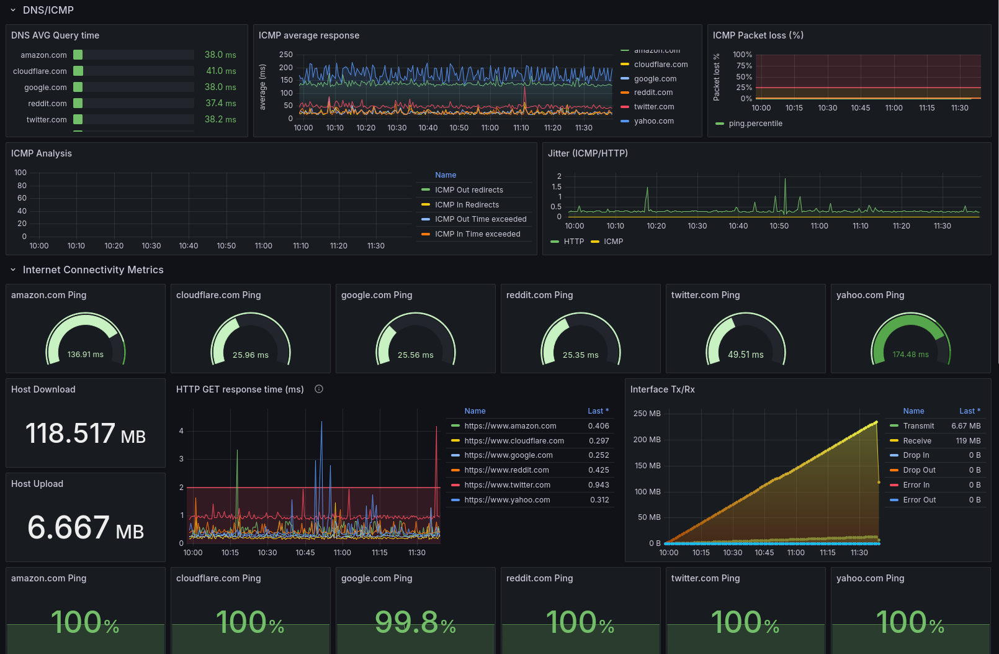
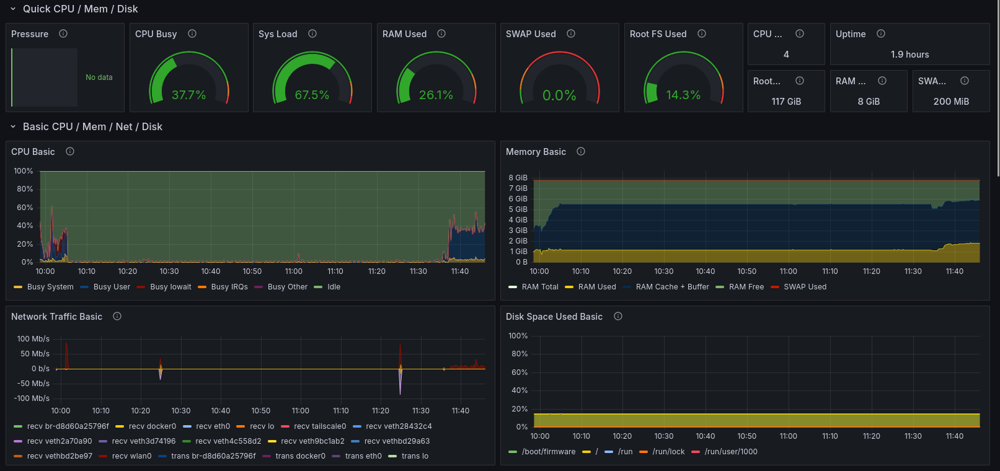
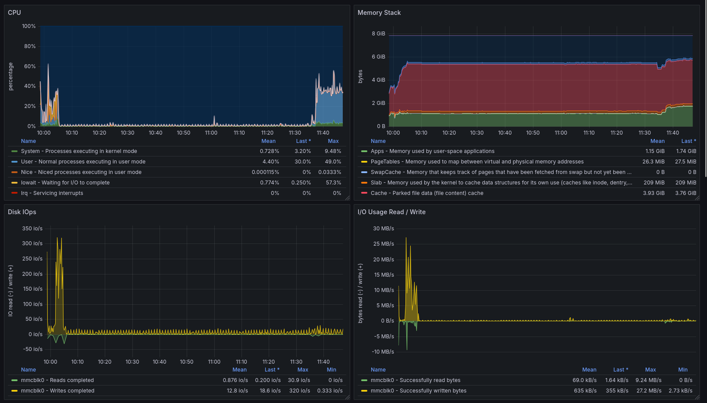

# SoWN-Starlink


This repository is part of the **Security of Wireless Networks** course and focuses on the **Starlink** satellite network.  
The project aims to analyze Starlink's performance and network behavior through comprehensive dashboards and data visualization tools, leveraging various monitoring and analysis tools.

## Project Overview

The goal of this project is to set up a robust analysis and monitoring environment for Starlink.  
By combining tools like Grafana, Prometheus, and custom Starlink exporters, the project provides insights into Starlink's network traffic, latency, stability, and security.

<div align="center">
  
</div>

### Features

- **Real-time Starlink Data Dashboards**: Visualize key metrics of Starlink's network performance.
- **Automated Monitoring Setup**: Easily deploy Grafana, Prometheus, Telegraf and Portainer using Docker compose.
- **Network Traffic Analysis**: Capture and analyze packet data using Wireshark.
- **SpaceX API Integration**: Research and possibly integrate SpaceX's API (v4) for additional telemetry.

## Project Goals

- ✅ **Raspberry Pi Setup**
- ✅ **Grafana and Prometheus Integration**
- ✅ **Starlink Exporter Setup**
- ✅ **Docker Compose Configuration**
- **SpaceX API (v4) integration**
- **Grafana dashboards**
- **Wireshark Packet Analysis**
- **Traceroute for Latency and Route Insights**

## Getting Started

To get started with this project, ensure that Docker and Docker Compose are installed on your system.  
This setup will initialize the required services, allowing you to monitor and analyze Starlink data.

### Prerequisites

- **Hardware**

  - Raspberry Pi 5 [(link)](https://datasheets.raspberrypi.com/rpi5/raspberry-pi-5-product-brief.pdf)
    - 2.4GHz quad-core processor
    - 4GB RAM
    - Dual-band 802.11ac Wi-Fi
    - Bluetooth 5.0 / Bluetooth Low Energy (BLE)
    - 2 × USB 3.0 ports, supporting simultaneous 5Gbps operation
    - 2 × USB 2.0 ports

  - Starlink | Standard [(link)](https://api.starlink.com/public-files/specification_sheet_standard.pdf)
    - Satellite dish with kickstand
    - Router

      - 802.11 a/b/g/n/ac/ax
      - Two (2) Latching Ethernet LAN ports with removable cover

- **Software**

  - Raspberry Pi OS
  - **Docker** and **Docker Compose**
  - Networking tools **Wireshark** and **Traceroute**

### Installation

Clone the repository:

```bash
git clone https://github.com/sstrinic/SoWN-Starlink.git
cd SoWN-Starlink
```

### Setup

1. **Start all services**: Run the following command to start Grafana, Prometheus, and other services.

   ```bash
   docker-compose up -d
   ```

2. **SELinux enabled distros like RHEL-based distros**: If you are using SELinux, use this command to ensure proper Docker permissions.

   ```bash
   sudo chcon -Rt svirt_sandbox_file_t <directory_name>
   ```

### Accessing the Dashboards

Once the services are up, you can access Grafana at `http://localhost:3000`.  
Here, you’ll be able to monitor Starlink data through various pre-configured dashboards.

## Usage

- **Grafana**: Visualize real-time network performance, latency, and other metrics for Starlink.
- **Wireshark**: Capture and analyze Starlink packet data to examine security and performance.
- **Traceroute**: Measure the latency and route of packets through the Starlink network.
- **Integration with SpaceX API**: Potential integration with SpaceX API for real-time satellite data.

## Grafana Dashboards

**Dashboards are not currently done and there are some bugs.**

<table>
  <tr>
    <td></td>
    <td></td>
  </tr>
  <tr>
    <td></td>
    <td></td>
  </tr>
</table>

## License

This project is licensed under the MIT License. See the [LICENSE](LICENSE) file for details.
